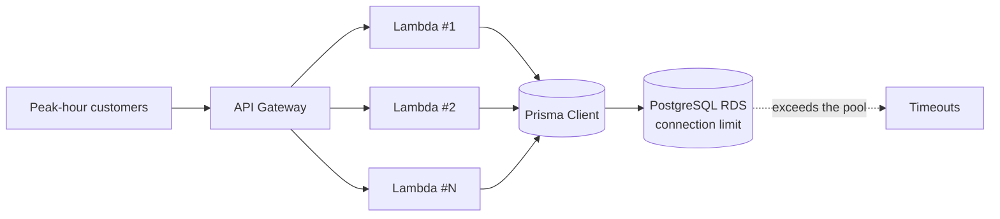
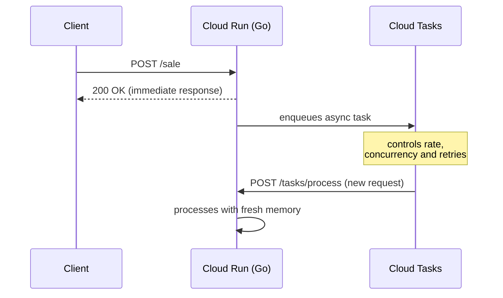
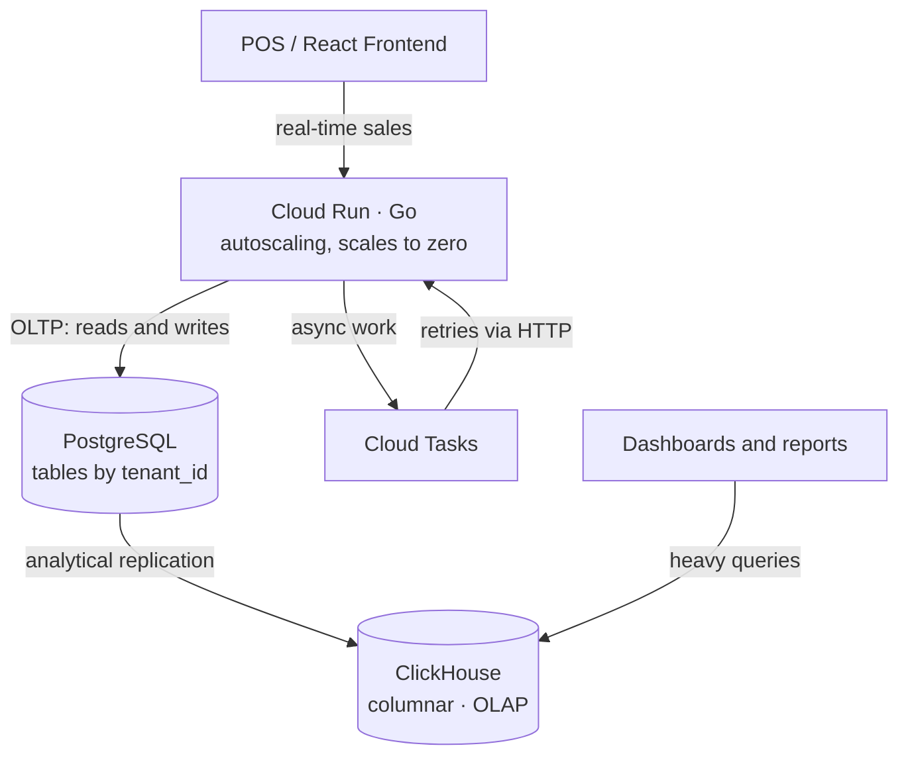

## Glossary

| Term          | Meaning                                                                                                                                                                                                                                            |
| ------------- | ------------------------------------------------------------------------------------------------------------------------------------------------------------------------------------------------------------------------------------------------- |
| POS system    | Point of Sale (POS) systems are those whose purpose is to cover what a cash register does in a business and its underlying functions: registering products, invoicing sales, tracking sales and keeping count of the money.                        |
| SaaS          | Software as a Service (SaaS) are software programs that provide a service in exchange for a monetary fee. For example, Netflix offers streaming in exchange for a monthly subscription.                                                            |
| FaaS          | Function as a Service (FaaS) is a cloud service that lets you run an atomic function on a remote machine.                                                                                                                                          |
| Tenant        | Each isolated customer within the same multi-tenant SaaS system. In Dayvent, each restaurant is a tenant that shares the infrastructure but not its data.                                                                                         |
| Cold start    | The time it takes for a new instance to be ready to serve its first request. It's critical in serverless environments, where instances are constantly created and destroyed.                                                                      |

## Context

Dayvent is a POS system for restaurants that is growing. It's currently in a gradual transition from being private software for an exclusive group of people, to becoming a mass-consumption SaaS, onboarding new customers in a controlled way until the features stabilize in real-world scenarios.

Three partners built it: one focused on the frontend with React, another on the backend with Java (learning Go along the way), and me as tech-lead, working across React, Java and Go. It's important to keep this in mind, because almost every architecture decision you'll see below is the product of crossing three variables: **the problem domain, the budget and the team's skills**.

And all of those decisions revolve around a single question.

## The question that defines the entire architecture

**Should I prioritize performance or productivity?**

First you have to understand the question. Prioritizing performance means building fast, robust software over fast development, and productivity means prioritizing fast development over the robustness and speed of the software.

The answer has always been "it depends". If performance didn't matter in any business, we'd all use Node.js for the backend and React for the frontend. And conversely, if productivity didn't matter, we'd all write the backend in Rust and the frontend in vanilla JavaScript.

- **Performance** prioritizes response speed and software quality.
- **Productivity** prioritizes how fast we can develop that software.

It's a decision made at every layer of the system, not just when the design starts. This article is about how I answered this question over and over while designing Dayvent.

Before tackling Dayvent, I want to clarify the framework I use to reason about each layer. I'm going to walk through the three design phases I went through:

1. Infrastructure
2. Database
3. Backend / Frontend

## The framework: how I reason about each layer

POS systems must be fast. A business during peak hours, with a long line of customers, can't afford its POS system being the bottleneck. Structuring the database well, having good development practices and knowing about system design is the key to achieving high performance in these scenarios.

But "fast" doesn't imply there should be "over-engineering", and "productive" doesn't mean "things should be done poorly" either. The framework constantly lives on that balance.

### Infrastructure

Before proceeding with any part of the design, you first have to think about which environment is going to run our backend, database, frontend and other services.

It's important to do it from the very first moment, because systems that don't conceive infrastructure before starting their design end up limited at deployment time. This part is closely tied to the budget and the context in which the system is developed.

Let me show it with an example that illustrates why this is not a minor detail. Let's assume you already designed and developed a system for a company whose infrastructure is set up on `AWS`. You built the backend with NestJS + Prisma ORM, the database with PostgreSQL and the frontend with Next.js. Everything works perfectly on your local machine, but the company didn't allocate enough budget to pay for an `EC2` for your backend.

With that limited budget, you opt for the following:

1. You deploy the NestJS backend on `AWS Lambda` for its serverless nature and expose it with `AWS API Gateway`, which seems to fit the budget.
2. You create a database instance on `AWS RDS` and connect the backend directly.
3. You deploy the Next.js frontend on Vercel.

Weeks later, the company complains: they got a bill for $3,000 USD. And there you ask yourself: _"What did I do wrong?"_.

What happened is that you didn't conceive the infrastructure at design time. You didn't think about the budget, nor the runtime environment, nor what your software actually needs. You made three very common design mistakes:

1. **NestJS relies heavily on TypeScript decorators**, which lengthens startup because doing `reflection` across the whole app is a CPU-intensive task. In a serverless environment, this translates into fairly long cold starts. With NestJS, almost for efficiency's sake, you're forced to use an EC2 for monolithic applications.
2. **AWS Lambdas are FaaS**: they're designed to do a single task, closer to an endpoint. AWS reuses the same execution environment for requests that arrive sequentially, but it creates a new instance for each **concurrent** request. Under load (exactly a POS's peak hour) that translates into dozens of parallel instances, each paying its own cold start. Hosting an entire backend application inside there is catastrophic.
3. **Serverless environments with several instances should not connect directly to the database.** Each instance is independent and uses its own `Prisma ORM` client, so each execution opens new connections. Postgres has a connection limit and rejects the ones that exceed it; at the network level that translates into timeouts waiting for the connection pool. The solution is an external connection pooler, **but watch out for the tool**: `AWS RDS Proxy` seems like the obvious answer and it isn't, alongside Prisma. Because of the way RDS Proxy _pins_ connections to the client, it provides no pooling benefit when used with Prisma Client (as [Prisma itself documents](https://www.prisma.io/docs/orm/prisma-client/setup-and-configuration/databases-connections#aws-rds-proxy)). The real way out there is a pooler designed for this case (for example `Prisma Accelerate` or `PgBouncer` in transaction mode), and not RDS Proxy.

Seen as a whole, the trap looks like this: each concurrent request spins up its own instance, and each instance opens its own connections against a database with a fixed limit.



All those mistakes could have been avoided by thinking about infrastructure first. Had you known the app was going to run in a serverless environment, you would have created atomic endpoints (probably with Express.js or Hono if your expertise is JavaScript) and deployed each one as a lambda.

A proper infrastructure approach means knowing the environment's limitations, the available budget, the application's special needs and the cloud provider you're going to use.

**Careful:** you don't need to decide the concrete services your app will use yet; that comes at the end. This step only comprises understanding the environment and its limitations. Keep that example in mind, because later you'll see how Dayvent avoided exactly this trap.

### Database

Laying out the database early is fundamental, because on one hand it gives you an understanding of how the business works and, on the other, it lets you identify the data structure.

This step isn't only about defining the structure: you also have to understand the challenges the application will face so that, among the possible solutions, you pick the one that best fits the situation.

For example, if the application is messaging, maybe the most suitable choice is a non-relational database like `MongoDB`. What matters about this decision is the document model, which fits the problem domain: "a message is a self-contained document (author, content, attachments, metadata) that is almost always read whole and from a single collection without `joins`". That pattern of heavy writes and reads without complex relations is precisely the scenario where MongoDB is useful: it sustains a continuous flow of inserts and serves each document without recomposing data scattered across several tables.

For a POS system, on the other hand, the most suitable choice is a relational database, because sales connect to products and stock, and the complexity of the reads becomes high. That's harder for MongoDB to handle: while its aggregation pipeline gives flexibility to `lookup` across collections, it faces a performance problem when joining documents and a memory problem when embedding entire BSON documents into the result. Postgres, in contrast, joins columns in memory in a much more compact way.

### Backend / Frontend

Backend and frontend share a similar design philosophy, because both face the same dilemma: **performance or productivity?**

To answer it in each case, it helps to identify the following:

1. **Delivery deadlines:** if we have stakeholders, we must identify a deadline for the deliverables aimed at those stakeholders.
2. **Team knowledge:** if deadlines are tight and the team knows `Java`, it's not the time to try the trendy technology you saw popping up.
3. **Budget:** how much infrastructure budget does the system consume? How much does the development team consume? These are questions to answer before choosing technologies.

### The over-engineering problem

There are situations where the balance tilts toward performance: generous deadlines, sky-high quality expectations, large investment. Even so, over-engineering still exists. Not every performance-focused software has to be made of microservices, be event-driven and implement the hexagonal pattern.

A frontend starts to justify micro-frontends when the CI/CD cycle becomes the bottleneck between each release, the monolith being so large that it needs to be split to optimize delivery times.

A backend justifies microservices when the monolith slows down the CI/CD cycle, or when it benefits from the features of another language: for example, an analytics microservice in Python with NumPy and Pandas.

Designing a performance-focused system means using the technologies and tools that guarantee excellent performance (careful: excellent, not the best nor a perfect one), sacrificing some development time.

### The over-technical-debt problem

On the other side, in situations that lean toward productivity (short deadlines, little investment, immediate release to production) there's technical debt, which is acceptable until too much of it accumulates.

When it isn't paid off, the consequences are serious: costs rise due to the system's inefficiency and bugs become routine.

Productivity can be prioritized without throwing away the architecture or good practices. A productivity-focused system is one where the technologies enable a shorter development time, sacrificing some performance. That's very different from doing things poorly, as happens when over-technical-debt accumulates.

## Dayvent in practice

With that framework clear, let's get concrete. Which way did the balance tilt in Dayvent?

Toward **performance**, and for three very concrete reasons:

- **The domain requires it:** A POS that stutters during peak hours is a POS that loses sales. For this business, speed goes straight into the list of requirements, at the same level as invoicing correctly.
- **Tight budget:** Performance isn't only measured by speed itself; the idea is to do more with fewer resources. A serverless environment is ideal for this case.
- **It's our long-term product:** We want to sustain and scale it over years, so working on performance today means less debt in the future.
- **The deadlines were generous.** We didn't have the pressure of an immediate delivery date, so we could afford to sacrifice some productivity in exchange for quality.

Now, leaning toward performance does **not** mean turning on over-engineering. At each layer I looked for the point where performance was excellent without becoming an unmanageable monster for a team of three people. This is how I reasoned about it.

### Infrastructure: GCP and Cloud Run

Remember the $3,000 USD bill from the AWS example? The root of the problem was cramming a heavy, slow-starting backend into a FaaS model that wasn't made for it. I wanted the opposite: **autoscaling and pay-per-use, but without paying the price of the cold start nor that of a fixed server running 24 hours.**

That's why I chose **Google Cloud Run**. Cloud Run is a _CaaS_ (Container as a Service); it runs the backend as a container with autoscaling: it scales to zero when there's no traffic and grows on demand, but it doesn't force me to split the application into atomic functions like a lambda. It's the exact middle ground between "paying for a fixed EC2" and "forcing the whole app inside a FaaS". And this is where the backend decision and the infrastructure decision reinforce each other: since the backend is in Go, which compiles to a binary that starts almost instantly, the cold start (the Achilles' heel of the NestJS example) stops being a problem.

For asynchronous work I use a queue with **Cloud Tasks**. In Go, the ideal way to run asynchronous tasks after responding to the client would be to do the following:

```go
go asynctask.Execute(ctx.Background)
```

However, Cloud Run reserves a portion of memory for each incoming request. After responding to the client, that portion of CPU and RAM is readjusted. If an asynchronous function runs, Go runs out of memory for the Goroutine. In this scenario, the right thing is to use a queue that opens an HTTP request to the backend and resolves that asynchronous call, managing execution rate, concurrency and retries.



### Database: Postgres, partitioned by tenant and ClickHouse

Following the framework, for the transactional core (sales, products, stock) the decision was **PostgreSQL**: the reads are relationally complex and Postgres resolves them compactly and quickly.

Since Dayvent is multi-tenant, the default model is simple: **shared tables with a `tenant_id`**. It's the most productive option and enough for the vast majority of restaurants. But I didn't just apply it blindly: **I partitioned by tenant only in exceptional cases, when a "hot" customer (with very high query volume) starts to degrade the performance of the others**. Partitioning has an operational cost, so I only pay it where performance justifies it. This is exactly the framework in question: productivity is treated by default, and performance is applied where the traffic requires it.

Analytics are a separate case. Cramming heavy aggregations (reports, sales trends, dashboards) onto the same transactional database would punish the POS right when it needs to go fastest. That's why I separated the workloads: the OLTP flow lives in Postgres, and I resolve analytical (OLAP) queries with **ClickHouse**, a columnar database oriented toward big data. This way, the restaurant owner can view large reports without affecting the cash flow for their employees.

Putting all the layers together, this is how Dayvent's architecture ends up: each decision (Cloud Run, Cloud Tasks, Postgres, ClickHouse) takes the place where its strength matters.



### Backend / Frontend: Go and React

This is where the central question is clearest, because I answered it differently for each side.

For the **backend I chose Go**, the clearest bet on performance: small binaries with instant startup (perfect for Cloud Run), excellent concurrency and low resource consumption. The cost is productivity (Go is more verbose and one of my partners came from Java and was learning it), but with generous deadlines and a long-term product, that cost was acceptable. Being a tech-lead who works with Go, I could comfortably take on the team's learning curve.

For the **frontend I chose React**, and this time I leaned toward productivity. Frontend performance matters, but it's not the one in charge of concurrency, nor where the bottleneck is during a restaurant's peak hour; the backend carries that weight. React gives us a huge ecosystem, development speed and, most importantly, it's the technology the frontend partner already mastered. Forcing an ultra-optimized technology here (like Vanilla JS or Vue with its vdom-less vapor mode) would have meant sacrificing productivity in exchange for a performance the domain wasn't demanding — in short, it was over-engineering.

That's the full lesson: instead of chasing "the best technology" in the abstract, I chose performance where the business demanded it (backend, database, infrastructure) and productivity where it didn't (frontend), taking my team's capacity into account.

## Conclusions

Designing Dayvent consisted of answering that same "performance or productivity" question at each layer and with that layer's information, instead of resolving it once and for all at the start of the project:

- **Infrastructure comes first:** Thinking about the environment before the code avoids surprise bills and decisions that can't be rewound later.
- **Performance and productivity where they're needed:** Go, Postgres and Cloud Run answer to performance. And React answers to productivity.
- **Avoid the two extremes:** Over-engineering makes you pay for unnecessary complexity. Over-technical-debt makes you pay interest that never ends. Design that's well done finds an equilibrium on the balance we mentioned earlier.

If you take one idea or lesson away from this article, the ideal one is this: **instead of aspiring to the "correct" architecture for everything, aspire to the one that turns out to be correct for your context.** And knowing how to read that context (when to pay for performance and when to pay for delivery speed) is what software design is about.

## Sources

- [Google Cloud Run (official documentation)](https://cloud.google.com/run/docs)
- [Google Cloud Tasks (official documentation)](https://cloud.google.com/tasks/docs)
- [PostgreSQL: Table Partitioning](https://www.postgresql.org/docs/current/ddl-partitioning.html)
- [ClickHouse: Why is ClickHouse fast?](https://clickhouse.com/docs/en/concepts/why-clickhouse-is-so-fast)
- [Prisma: Connection pool and serverless environments](https://www.prisma.io/docs/orm/prisma-client/setup-and-configuration/databases-connections)
- [Prisma: AWS RDS Proxy pins connections (no pooling benefit with Prisma Client)](https://www.prisma.io/docs/orm/prisma-client/setup-and-configuration/databases-connections/configure-pg-bouncer#aws-rds-proxy)
- [AWS Lambda: execution environment reuse](https://docs.aws.amazon.com/lambda/latest/dg/lambda-runtime-environment.html)
- [AWS RDS Proxy (official documentation)](https://docs.aws.amazon.com/AmazonRDS/latest/UserGuide/rds-proxy.html)
